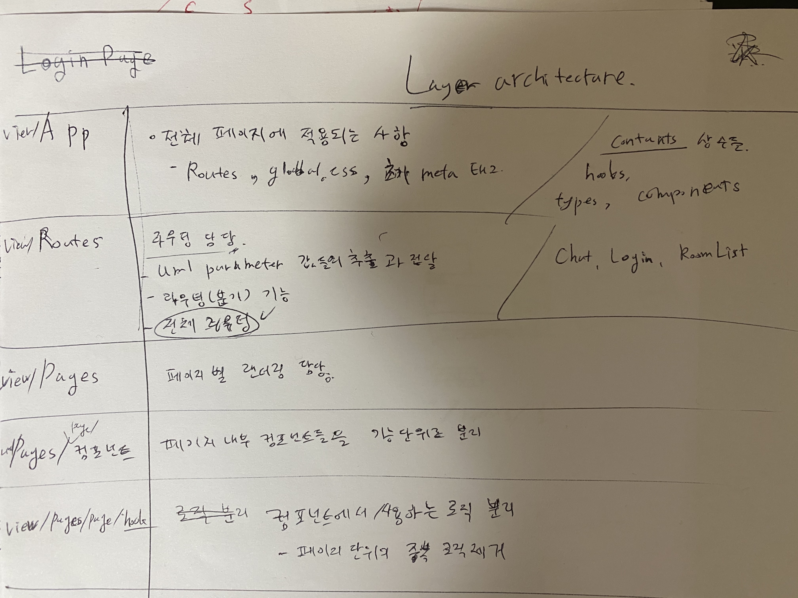

# 개발 환경 시작

## install

**./client, ./server**
```shell
  npm install
```

## Build & Start (Watch file)

**./client**
```shell
  npm run build -- -w
```

**./server**
```shell
  npm run build -- -w
```

**./server**
```shell
  npm start
```

# 개발 계획
기술: WebSocket / React 사용




## UI
- 최소한으로 (css 없이)
- 페이지 목록
  - LoginPage: Login 하는 페이지
  - RoomListPage: 방 목록 보여주는 페이지
  - ChatPage: 채팅창 페이지

## API
Login / Room List

**Login**
- POST /api/login
- request: { userId: string }
- response: token (userId 정보가 들어있는 JWT)
- server vaildate: 
- userId 3자리 이상 검사

**Room List**
- GET /api/room
- request: None
- response: { roomList: { id: string, name: string }[] }

## WebSocket
- Join Room / Send Message / Post Message
- 공통 namespace: /socket/chat
```js
const socket = io('/socket/chat');
```

**Join Room** 
- socket.emit()
- event name: 'join'
- parameter: , { roomId: string, token: string } (userId 정보가 들어있는 JWT)

response(ack): token (userId 정보, roomId정보가 들어있는 JWT)
server vaildate: 
- JWT 무결성 검사
- roomId정보 포함 여부 및 서버에 있는 roomId가 맞는지 검사

**Send Message**
- socket.emit()
- event name: 'send message'
- parameter: { message: string, token: string } (userId 정보, roomId정보가 들어있는 JWT)

response(ack): token (userId 정보, roomId정보가 들어있는 JWT)
server vaildate: 
- JWT 무결성 검사
- userId 정보, roomId정보가 들어있는 JWT 가 맞는지 검사
- message 1자리 이상인지 검사

**Post Message**
- socket.on()
- event name: 'add message'
- response(ack): { message: string }
- parameter: 없음


## 스펙
- 사진 전송 스펙은 제외 하고 구현
- 전송 메세지에 XSS 공격이 없는지 검사

## Test Code
- 필요시마다 작성
- 유틸 위주

## 이후 업데이트 사항 (중요도 순)
1. 사진 전송 스펙 구현
2. CSS 적용

## ETC
- JWT 는 sessionstorage 에 저장